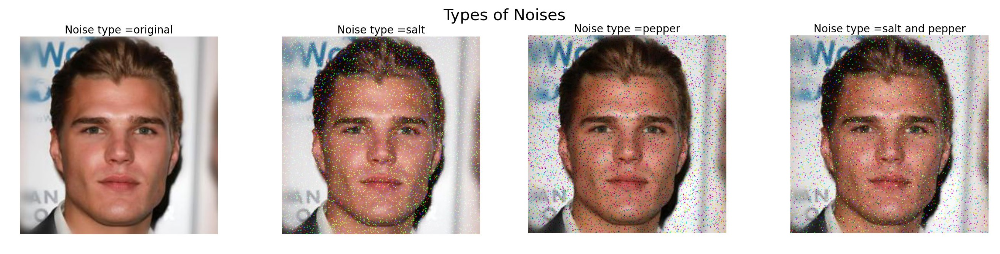
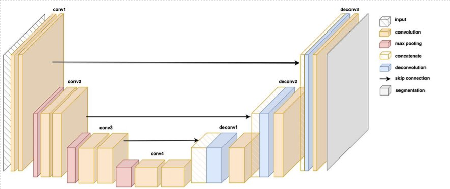
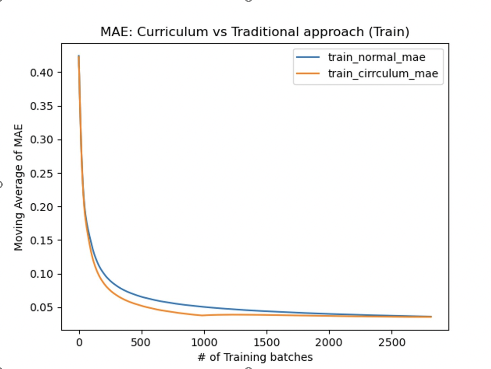
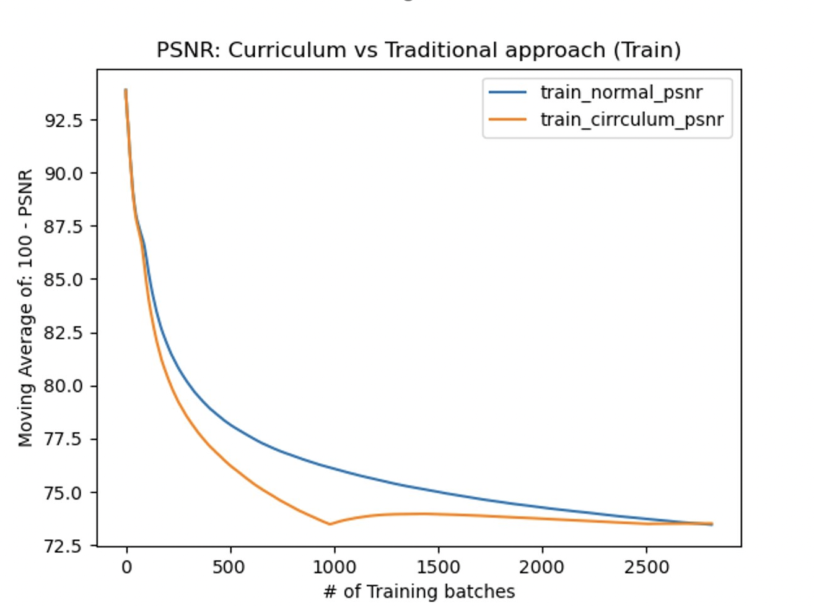
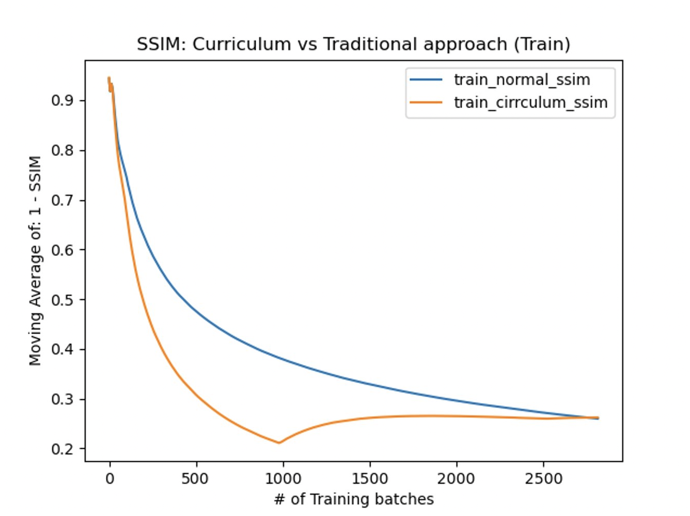
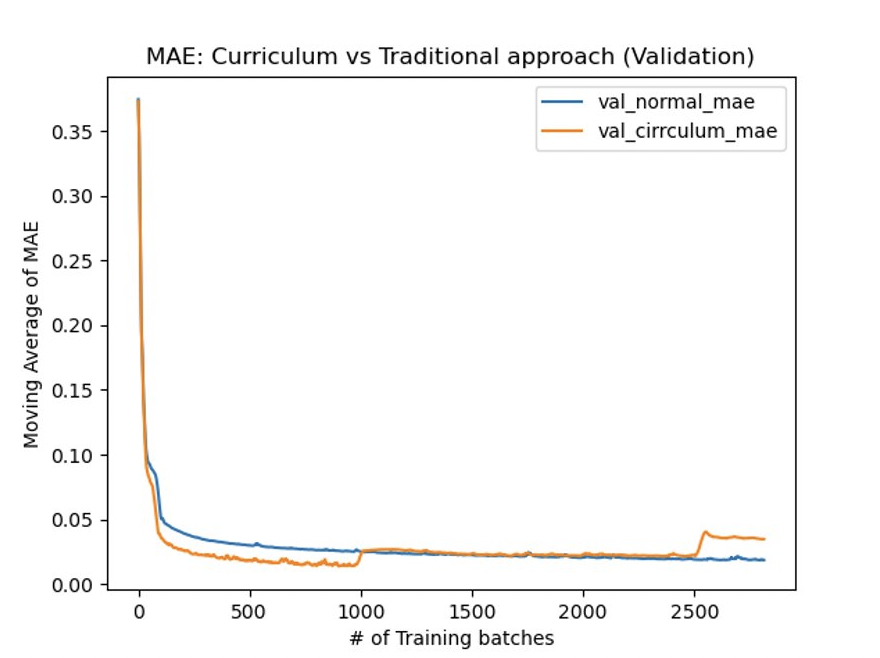
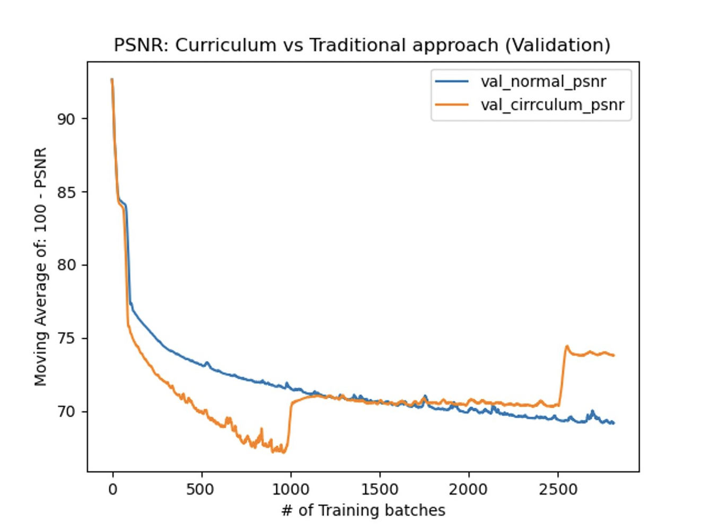
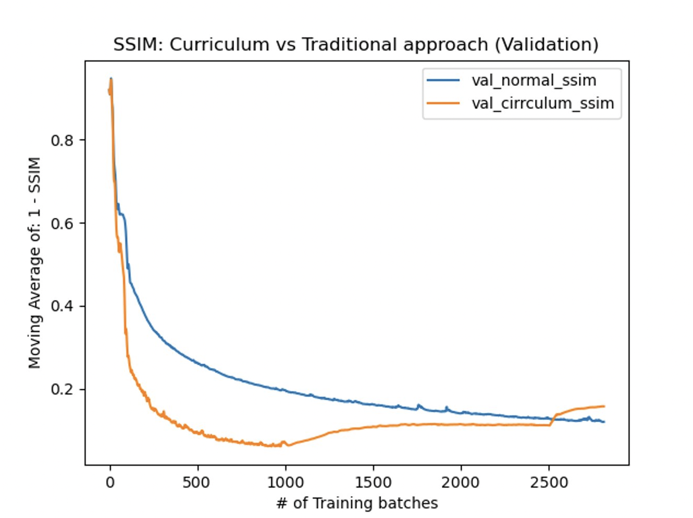

# Machine-learning-project-
This project is done by Kush Jayank Pandya, Jash Shah, Hrishikesh Salunkhe, Dwijiesh Jigarbhai Shah, Shreya Rajendra Pai and Haarika Ambati.


# Exploring Curriculum Learning for Image Denoising

## Authors
- Kush Jayank Pandya 
- Jash Shah 
- Hrishikesh Salunkhe
- Dwijiesh Jigarbhai Shah
- Shreya Rajendra Pai 
- Haarika Ambati

## Introduction

### Curriculum Learning

Humans generally learn the easy things first, clear their concepts, and then do complex tasks. For example, a child first learns basic arithmetic, then learns algebra before solving calculus problems. We take the idea of using a curriculum for humans to learn and apply it to Machine Learning.

Curriculum Learning [1,2,3] is a training strategy that trains a Machine Learning model from more straightforward to more challenging data. The idea is to use the strategy of how humans learn, i.e., learning easier problems first and taking more complex problems afterward. It has shown its advantages by showing faster convergence, better generalization, and using less computation while training compared to other machine-learning models.

The general idea of Curriculum Learning depends on two things:
1. Difficulty measurer: Difficulty measurer is a metric to define the difficulty level of the data.
2. Training Scheduler: The training scheduler decides the sequence of data subsets throughout the training process based on the current model expertise.

### Image Denoising

Image Denoising is a process to remove corruption in an image caused by different factors. Denoising an image is difficult since the noise is tied to the image's high-frequency content, i.e., the details. As a result, the goal is to strike a balance between suppressing noise as much as possible and not losing too much information.

#### Types of Corruption

In this project, we are going to handle different types of frequent image noise [4], which are:

1. **Salt Noise**: It's common noise seen in photography, bright and white pixels/small spots caused by errors during the image capture or transmission process.
2. **Pepper Noise**: It's common noise seen in photography, bright and black pixels/small spots caused by dead pixels or errors in data transmission and memory cell failure.
3. **Salt and Pepper Noise**: This type of digital image noise is characterized by randomly occurring white and black pixels resembling grains of salt and pepper.



#### Types of Error Metrics

In our project, we compare the original image with the resultant denoised image based on the following comparison metrics [5]:

1. **MAE/L1**: Mean Absolute Error is the absolute difference between each predicted value and its associated actual value, divided by the total number of data points. A lower MAE indicates better denoising performance.
2. **SSIM**: Structural Similarity Index Measure is a technique for forecasting the observed quality of digital images and videos. It predicts the structural information that the pixels hold, which carries important details about the structure of the items in the visual scene.
3. **PSNR**: Peak Signal-to-Noise Ratio is a measure of the quality of the reconstruction of lossy compression codecs. It approximates the human perception of reconstruction quality.

## Methodology
### Our Approach

Curriculum learning has great potential, but it comes with its own set of challenges. Most importantly, the overhead of classifying the difficulty of data points should be less than directly training the model. One reason curriculum learning should be effective in image denoising is that it's straightforward to classify data into difficulty levels. We can easily control the amount of corruption in an image, thus setting the difficulty level of that image data.

The idea is to start training the model with relatively low corrupted data (i.e., a low difficulty level), where the gradient descent will keep decreasing until it drops below a predefined threshold error value. It will signify that the model has gained expertise for that difficulty level and can be trained for higher difficulty levels. Thus, we introduce incrementally difficult data for the next iteration of training the model. This iterative process is repeated until we reach the highest difficulty level with loss below the threshold or the training runs out of epochs.

The learning rate scheduler controls the difficulty level while training. The threshold metric for this project would be PSNR. If the moving average of PSNR exceeds 27.5 decibels, we increase the difficulty level. The pseudo-code of how it works is shown below:

```python
def on_batch_end():
    psnr_moving_average = get_moving_average(batches=5)
    if psnr_moving_average < threshold:
        if difficultylevel >= maxdifficultylevel:
            STOP_TRAINING()
        else:
            increase_difficulty_level()
```

# Exploring Curriculum Learning for Image Denoising

## Model Architecture

For this project, we have made use of U-net[6]. This architecture is mainly used in biomedical image segmentation based on a fully convolutional network. The architecture has two parts: a contracting path and an expansive path.

The U-Net architecture is characterized by a U-shaped network, with a contracting path followed by an expansive path. The contracting path is composed of convolutional layers and pooling layers, which gradually reduce the spatial resolution of the input image while increasing the number of feature maps. The expansive path is composed of up-convolutional layers and concatenation layers, which gradually increase the spatial resolution of the output while decreasing the number of feature maps.

Skip connections are also used in the U-Net architecture to link the respective levels in the contracting and expansive pathways. These connections enable the network to learn the low-resolution context features while preserving the high-resolution details from the input image.



## Comparison and Experimental Setup

For measuring the performance of the final model obtained using our Curriculum Learning approach, we will replicate the final model architecture into a newly generated model initialized with random weights. We would then train this new model using our entire training data without classifying it into different difficulty levels. Using the error metrics mentioned in section 1.2.2 and the execution time required for model training, we will compare the models obtained by the two approaches to understanding the benefits, differences, and potential drawbacks of our Curriculum Learning approach.

In this project, images of size 512 x 512 input size is being used. We will be training our models with 'Image-net' data subset with a training size of 45000 images and validation size of 5000 images.

We will be running our model for two epochs. For this project, we have taken the threshold to be PSNR. If the moving average of PSNR exceeds 27.5 decibels, We will increase our difficulty. The rationale behind the threshold is that it's considered a decent image restoration if the PSNR of the restored and original image is above 25 - 30. So 27.5 was an intuitive choice. But here, we'll be using the PSNR metric to be 100 - PSNR. The reason for the inversion is so that we can see the graph with convergence rather than increase.

Our models have been made using TensorFlow and trained using Kaggle GPUs.

## Results

During carrying out the comparison process, the values of each error metric are recorded to be used as the model convergence metric. For each error metric, the convergence of both the Curriculum Learning-based model and traditional model are plotted across both the number of training set batches and validation set batches.

The following are our findings from the error metrics recorded during the comparison process, which are shown in figure 3 & 4:

1. Faster Initial Convergence: The Curriculum Learning based model exhibited faster initial convergence than the traditional model across the first 1000 batches.

    Understanding - The Curriculum Learning based model is able to converge faster than the traditional model since it is initially fed lower difficulty level data compared to that of the traditional model.

2. Convergence Spike: A spike is observed in the Curriculum Learning based model convergence at the 1000 batches mark.

    Understanding - At a certain point, a spike is observed in the Curriculum Learning based model convergence because the predefined threshold is being crossed at that point and the difficulty level of data is being increased. Since the model weights need to readjust for this change in difficulty, the performance falls to the level of that of the traditional model.

3. Optimal Convergence: The Curriculum Learning based model and the traditional model exhibit similar convergence values starting from the 1000 batches to 2500 batches.

    Understanding - After the difficulty level is increased, the Curriculum Learning-based model shows similar performance as that of the traditional model because the difficulty levels of both models are coming closer, and the weights are adapting similarly.

4. Less than Optimal Convergence: The Curriculum Learning based model shows lesser convergence than the traditional model post 2500 batches mark.

    Understanding - The performance of Curriculum Learning based model drops in the long run since the difficulty level is increased again and the weights require re-adjusting. Additionally, while the traditional model is trained across data with fixed difficulty level, the Curriculum Learning based model is presented with a higher level of difficulty once it comes close to gaining expertise.


**Figure 3: MAE (Mean Absolute Error)**


**Figure 4: PSNR (Peak Signal to Noise ratio)**


**Figure 5: SSIM (Structural Similarity Index)**


**Figure 6: MAE (Mean Absolute Error)**


**Figure 7: PSNR (Peak Signal to Noise ratio)**


**Figure 8: SSIM (Structural Similarity Index)**

## Conclusion

We conclude our observations with the following inferences:

Benefits: Faster initial convergence compared to a traditional model is one of the potential benefits of the Curriculum Learning approach.

Drawbacks: On the other hand, less than optimal convergence is one of its potential drawbacks.

Applications: Potential applications suitable for the Curriculum Learning approach include training models over data that particularly results in slow convergence.

Finally, the Curriculum Learning approach has shown great potential and exciting prospects for future studies and research.

## References

1. X. Wang, Y. Chen, and W. Zhu, 'A Survey on Curriculum Learning'. arXiv, 2020.
2. Y. Bengio, J. Louradour, R. Collobert, and J. Weston, 'Curriculum Learning', in Proceedings of the 26th Annual International Conference on Machine Learning, Montreal, Quebec, Canada, 2009, pp. 41–48.
3. A. M. Hamdi, “Curriculum Learning in Deep,” Omdena, Feb. 11, 2022. [Medium Article](https://medium.com/omdena/curriculum-learning-in-deep-d52fa1cbe188)
4. V. Lendave, “A Guide to Different Types of Noises and Image Denoising Methods,” Analytics India Magazine, Sep. 25, 2021. [Article Link](https://analyticsindiamag.com/a-guide-to-different-types-of-noises-and-image-denoising-methods/)
5. H. Zhao, O. Gallo, I. Frosio and J. Kautz, "Loss Functions for Image Restoration With Neural Networks," in IEEE Transactions on Computational Imaging, vol. 3, no. 1, pp. 47-57, March 2017, doi: 10.1109/TCI.2016.2644865.
6. Olaf Ronneberger, Philipp Fischer, & Thomas Brox. (2015). U-Net: Convolutional Networks for Biomedical Image Segmentation.
